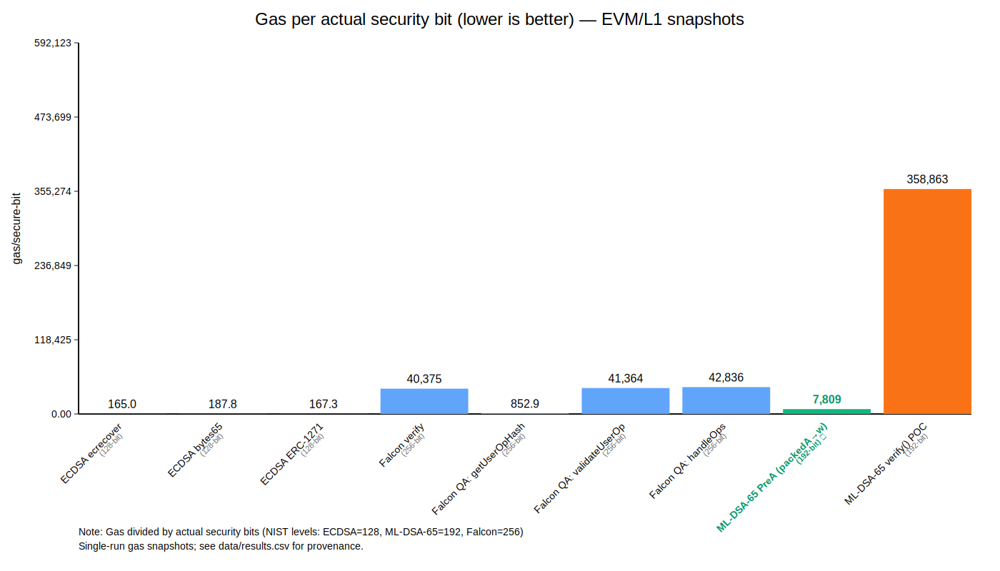

# Gas per Secure Bit

<div align="center">

**Benchmarking post-quantum signatures and verifiable randomness on EVM by gas cost per cryptographically meaningful bit.**

[](https://opensource.org/licenses/MIT)
[](https://getfoundry.sh/)

</div>

---

## Table of Contents

- [Methodology (surfaces + weakest-link)](#methodology-surfaces--weakest-link)
- [Core Metric](#core-metric)
- [Public Review Entry Points](#public-review-entry-points)
- [Why This Exists](#why-this-exists)
- [New: Weakest-link + Protocol Readiness Surfaces](#new-weakest-link--protocol-readiness-surfaces)
- [Reproducible Reports & Data Policy](#reproducible-reports--data-policy)
- [Measured Protocol Surfaces (EVM/L1)](#measured-protocol-surfaces-evml1)
- [Chart](#chart)
- [Current Dataset (EVM/L1) — Gas Snapshots](#current-dataset-evml1--gas-snapshots)
- [What We Built](#what-we-built)
- [Repo Layout](#repo-layout)
- [Dataset Schema (CSV)](#dataset-schema-csv)
- [Security Normalization (Explicit Assumptions)](#security-normalization-explicit-assumptions)
- [Quick Start](#quick-start)
- [Benchmarks Included](#benchmarks-included)
- [Related Work / References](#related-work--references)
- [Roadmap](#roadmap)
- [License](#license)
- [Disclaimer](#disclaimer)
- [Maintainer](#maintainer)
- [Citation](#citation)

---

## Methodology (surfaces + weakest-link)

To avoid mixing benchmark scopes, the dataset supports a surface taxonomy and an optional dependency graph:

- **Canonical execution surfaces (S0–S3):** `spec/case_graph.md`
- **Case catalog / baseline nodes:** `spec/case_catalog.md`
- **Weakest-link report (generated):** `reports/weakest_link_report.md`
- **One-page status summary:** `reports/summary.md`

For any pipeline record with `depends_on[]`:

```
effective_security_bits = min(security_bits(dep_i))
```

Where `security_bits(x)` is derived from records with `security_metric_type ∈ {security_equiv_bits, lambda_eff, H_min}`.

This repo may record multiple denominators for the same bench (e.g., `lambda_eff` for conservative crypto strength and `security_equiv_bits` for declared normalization) as separate records; comparisons must state which denominator is used.

---

This repository is an experimental benchmarking lab spun out of  
[`ml-dsa-65-ethereum-verification`](https://github.com/pipavlo82/ml-dsa-65-ethereum-verification).

It exists to answer one practical question for Ethereum engineers:

> **How expensive is "real security" on EVM — once you normalize gas by a declared security target and by protocol constraints?**

In other words: **"gas/verify" is not enough** if the protocol envelope bounds end-to-end security even when the wallet uses PQ signatures.

---

## Core Metric

GitHub does **not** render LaTeX by default, so the canonical formula is written in plain form:

> **gas_per_bit = gas_verify / security_metric_value**

Where:
- **gas_verify** — on-chain gas used to verify a signature / proof (or a verifiable computation step).
- **security_metric_type** — what the denominator represents:
  - for **signatures / proofs (today)**: `security_equiv_bits` (a declared *classical-equivalent bits* normalization convention)
  - for **randomness / VRF / protocol surfaces**: `H_min` (min-entropy of the verified output under an explicit threat model)
- **security_metric_value** — the denominator value in bits.

For the current signature-only dataset, we typically report:

> **gas_per_secure_bit = gas_verify / security_equiv_bits**

This allows apples-to-apples comparisons across schemes at different security targets, **under explicit assumptions**.

---

## Public Review Entry Points

If you have 10 minutes:
1. `reports/protocol_readiness.md` — protocol constraints and why "gas/verify" can be misleading.
2. `spec/case_catalog.md` + `spec/case_graph.md` — AA weakest-link (envelope dominance) cases + canonical graphs.
3. `spec/gas_per_secure_bit.md` — definitions, normalization rules, reporting conventions.
4. `data/results.jsonl` — canonical dataset (CSV + reports are deterministically rebuilt from it).

---

## Why This Exists

Most public comparisons stop at "gas per verify". That hides critical differences:

- Different security levels (e.g., ECDSA ~128-bit convention vs ML-DSA-65 ~192 vs Falcon-1024 ~256)
- Different verification surfaces (EOA vs ERC-1271 vs EIP-4337 pipeline)
- Different protocol envelopes (e.g., L1 constraints can bound end-to-end security regardless of wallet scheme)

This repo focuses on:
- **normalized units** (gas per declared security-equivalent bit), and
- **protocol-aware interpretation** (weakest-link / envelope dominance).

This is designed to compare not only **gas**, but also **what actually bounds security in protocol-aligned paths** (envelopes, attestations, entropy dependencies).

---

## New: Weakest-link + Protocol Readiness Surfaces

Besides single-bench gas numbers, this repo also models **end-to-end PQ readiness** of real execution paths.

- **Weakest-link security:** for a pipeline record with `depends_on`, the effective security is the minimum across dependencies.
  - Example: AA/UserOp paths can be PQ at the wallet layer but still be bounded by the **L1 envelope** assumption.
- **Entropy / attestation surfaces:** measured protocol surfaces (RANDAO, relay attestation) with `H_min` denominators.

Reports:
- `reports/weakest_link_report.md`
- `reports/protocol_readiness.md`
- `reports/entropy_surface_notes.md`

---
### Weakest-link composition (why normalization matters)

- Mermaid diagram: [spec/weakest_link.mmd](spec/weakest_link.mmd)


## Reproducible Reports & Data Policy

This repository follows a **single canonical source of truth** model for benchmark data and reports.

### Canonical Data

- **`data/results.jsonl`** is the **only canonical input**.
- Each line is exactly one JSON object (JSONL).
- All edits, additions, and corrections must be done in `data/results.jsonl` only.

### Derived Artifacts

The following files are **derived deterministically** and **must not be edited by hand**:

- `data/results.csv`
- `reports/summary.md`
- `reports/weakest_link_report.md`
- `reports/protocol_readiness.md`
- `docs/gas_per_secure_bit.svg`
- `docs/gas_per_secure_bit_big.svg`

Charts are derived from `data/results.csv` and must not be edited by hand.

They are rebuilt from `data/results.jsonl`.

### Canonical Pipeline

To regenerate all derived files locally:

```bash
./scripts/make_reports.sh
```

This script will:
1. Rebuild `data/results.csv` from `data/results.jsonl`
2. Validate JSONL integrity
3. Enforce uniqueness of `(scheme, bench_name, repo, commit, chain_profile)`
4. Generate all reports (including protocol readiness)

**Pipeline roles:**
- `scripts/parse_bench.py` — appends records to `data/results.jsonl` (ingestion)
- `scripts/rebuild_results_csv.py` — deterministically generates CSV + derived reports (invoked by `./scripts/make_reports.sh`)

### CI Enforcement

CI runs the same pipeline and fails if any generated file is not committed.

**CI workflow:** `.github/workflows/reports.yml`  
It runs `./scripts/make_reports.sh` and fails if `git diff` is non-empty.

```bash
git diff --stat
```

If the working tree is not clean after running `make_reports.sh`, the pull request will fail.

### Chain Profiles / L2 Aliases

Multiple records may exist for the same benchmark under different `chain_profile` values (e.g. `EVM/L1`, `EVM/L2:arbitrum_one`). 

These represent execution-equivalent measurements with different fee or threat-model contexts:
- **EVM execution gas is assumed equal** across profiles
- **Data availability / calldata pricing differs** by chain

---

## Measured Protocol Surfaces (EVM/L1)

Some protocol-level "surfaces" are now measured for gas on EVM/L1.  
For these entries, **gas is measured**, while the **security denominator** (e.g., `H_min`) may still be a **placeholder** until the threat model is finalized.

Current measured surfaces:

- `randao::l1_randao_mix_surface` — gas = **5,993**, `H_min` = **32** (placeholder)
- `attestation::relay_attestation_surface` — gas = **12,457**, `H_min` = **128** (placeholder)

Reproduce measurements and refresh dataset + reports:

```bash
./scripts/run_protocol_surfaces.sh
./scripts/make_reports.sh
```

See also:
- `reports/protocol_readiness.md` (weakest-link readiness table)
- `reports/weakest_link_report.md`
- `reports/summary.md`

---

## Chart



(Full-detail chart: [docs/gas_per_secure_bit.svg](docs/gas_per_secure_bit.svg))

> **NOTE:** Charts are derived from `data/results.csv` (rebuilt from `data/results.jsonl` via `./scripts/make_reports.sh`). If you change normalization conventions (e.g., ML-DSA-65 128 → 192), regenerate the dataset and charts.

---

## Current Dataset (EVM/L1) — Gas Snapshots

**Source of truth:** `data/results.jsonl` (CSV is deterministically rebuilt by `scripts/rebuild_results_csv.py` via `./scripts/make_reports.sh`).

### Signature & AA Benchmarks

| Scheme        | Bench name                                | gas_verify  | security_metric_value (bits) | gas / secure-bit |
|---------------|-------------------------------------------|------------:|-----------------------------:|-----------------:|
| **ECDSA**     | ecdsa_verify_ecrecover_foundry            | 21,126      | 128                          | 165.047          |
| **ECDSA**     | ecdsa_erc1271_isValidSignature_foundry    | 21,413      | 128                          | 167.289          |
| **ECDSA**     | ecdsa_verify_bytes65_foundry              | 24,032      | 128                          | 187.750          |
| **Falcon**    | qa_getUserOpHash_foundry                  | 218,333     | 256                          | 852.863          |
| **ML-DSA-65** | preA_compute_w_fromPackedA_ntt_rho0_log   | 1,499,354   | 192                          | 7,809.135        |
| **ML-DSA-65** | preA_compute_w_fromPackedA_ntt_rho1_log   | 1,499,354   | 192                          | 7,809.135        |
| **Falcon**    | falcon_verifySignature_log                | 10,336,055  | 256                          | 40,375.215       |
| **Falcon**    | qa_validateUserOp_userop_log              | 10,589,132  | 256                          | 41,363.797       |
| **Falcon**    | qa_handleOps_userop_foundry               | 10,966,076  | 256                          | 42,836.234       |
| **ML-DSA-65** | verify_poc_foundry                        | 68,901,612  | 192                          | 358,862.563      |

### Protocol Surfaces (measured)

| Scheme          | Bench name                    | gas_verify  | security_metric_value (bits) | gas / secure-bit |
|-----------------|-------------------------------|------------:|-----------------------------:|-----------------:|
| **RANDAO**      | l1_randao_mix_surface         | 5,993       | 32 (H_min)                   | 187.281          |
| **Attestation** | relay_attestation_surface     | 12,457      | 128 (H_min)                  | 97.320           |

**Note:** Protocol surfaces use `security_metric_type=H_min`; the current H_min values are declared placeholders until the threat model is pinned down. Gas numbers are measured; denominators are provisional. For surfaces, `gas_verify` denotes the measured gas of the surface operation/harness.

**Notes:**
- `qa_handleOps_userop_foundry` includes the full EIP-4337 pipeline (`EntryPoint.handleOps`), so it is **not** a "pure signature verify" cost.
- `falcon_verifySignature_log` is a **clean verifySignature-only** microbench extracted from QuantumAccount logs.
- `verify_poc_foundry` for ML-DSA-65 is a full decode + checks + `w = A*z − c*t1` POC (FIPS-204 shape), built for correctness + reproducibility.

---

## What We Built

A reproducible benchmark lab with:

### Dataset + Schema
- Canonical dataset: `data/results.jsonl` (source of truth)
- Derived table: `data/results.csv`
- Schema/spec documents under `spec/`
- `scripts/rebuild_results_csv.py` deterministically rebuilds `data/results.csv` from `data/results.jsonl` (invoked by `./scripts/make_reports.sh`)

### Runners (Reproducible Ingestion)
- `scripts/run_vendor_mldsa.sh` — ML-DSA-65 (Foundry gas + log extraction for PreA)
- `scripts/run_vendor_quantumaccount.sh` — QuantumAccount (Falcon) benches + log-based gas extraction
- `scripts/run_ecdsa.sh` — ECDSA baselines (ecrecover, bytes65 wrapper, ERC-1271)
- `scripts/run_protocol_surfaces.sh` — measures protocol surfaces gas (RANDAO mix + relay attestation), replaces old records, regenerates reports

### Protocol Interpretation Layer
- **Weakest-link / envelope dominance** case catalog and canonical graphs:
  - `spec/case_catalog.md`
  - `spec/case_graph.md`
- **Protocol readiness narrative:**
  - `reports/protocol_readiness.md`

---

## Repo Layout

- `bench/` — microbench contracts/tests for local measurement
- `scripts/` — runners + parsers
- `data/` — dataset outputs (CSV/JSONL)
- `docs/` — charts (SVG) derived from dataset
- `spec/` — definitions, methodology, case catalog, schema notes
- `reports/` — narrative reports connecting results to protocol constraints

Vendored repos may be stored under `vendors/`; provenance is always recorded per row. Vendor licensing remains upstream.

---

## Dataset Schema (CSV)

**Tabular format:** `data/results.csv` (derived from canonical `data/results.jsonl`)

Columns:
- `ts_utc` — timestamp UTC
- `repo`, `commit` — provenance of the implementation
- `scheme` — e.g., `mldsa65`, `ecdsa`, `falcon1024`, `randao`, `attestation`
- `bench_name` — benchmark identifier
- `chain_profile` — e.g., `EVM/L1` (extendable to L2 profiles)
- `gas_verify` — gas used for the bench
- `security_metric_type` — e.g., `security_equiv_bits` (signatures) or `H_min` (randomness/VRF/protocol)
- `security_metric_value` — metric value in bits (e.g., 128 / 192 / 256)
- `gas_per_secure_bit` — computed as `gas_verify / security_metric_value`
- `hash_profile` — e.g., `keccak256` or `unknown`
- `notes` — context + refs (runner, branch, extraction method)

Additional (optional) fields used for composed pipelines:
- `security_model` — e.g. `raw` or `weakest_link`
- `depends_on` — list of dependency record keys (`scheme::bench_name`) used to compute effective security

Right now (signature dataset) we primarily use:
- `security_metric_type = security_equiv_bits`
- `security_metric_value ∈ {128.0, 192.0, 256.0}`

For protocol surfaces:
- `security_metric_type = H_min`
- `security_metric_value` = declared min-entropy placeholder

---

## Security Normalization (Explicit Assumptions)

This repo separates:
1. A scheme's **security category** (when applicable), and
2. A declared **security-equivalent bits** normalization value used for comparisons: `security_equiv_bits`.

### Current Working Convention (Signatures; Normalization Only)

| Scheme | Security Category | `security_equiv_bits` | Notes |
|--------|-------------------|----------------------|-------|
| **ECDSA (secp256k1)** | - | 128 | classical security convention |
| **ML-DSA-65 (FIPS-204)** | Category 3 | 192 | classical-equivalent convention |
| **Falcon-1024** | Category 5 | 256 | classical-equivalent convention |

**Important:** These are normalization conventions, not security proofs. The rule is that they are explicit and applied consistently.

### Optional Baseline Normalization (Separate Metric)

If you want "per 128-bit baseline" as a convenience view:

```
gas_per_128b = gas_verify / 128
```

Label it explicitly as baseline (not "secure-bit").

---

## Quick Start

### Prerequisites
- Linux/WSL recommended
- `git`
- **Foundry** (`forge`)
- Python 3

### Build a Fresh Dataset (ML-DSA + ECDSA + Falcon + Protocol Surfaces)

From repo root:

```bash
cd /path/to/gas-per-secure-bit

# ECDSA (rows)
RESET_DATA=0 ./scripts/run_ecdsa.sh

# Protocol surfaces (RANDAO + relay) — measured + replace semantics
./scripts/run_protocol_surfaces.sh

# ML-DSA (rows)
RESET_DATA=0 MLDSA_REF="feature/mldsa-ntt-opt-phase12-erc7913-packedA" ./scripts/run_vendor_mldsa.sh

# QuantumAccount/Falcon (rows)
QA_REF=main RESET_DATA=0 ./scripts/run_vendor_quantumaccount.sh

# Regenerate derived artifacts (CSV + reports)
./scripts/make_reports.sh

wc -l data/results.jsonl data/results.csv
tail -n 20 data/results.csv
```

**Note:** If you want to rebuild from scratch, delete `data/results.jsonl` and rerun the runners. Derived files (CSV + reports) will be regenerated automatically.

### Sanity Check: Ensure Benches Are Unique

```bash
cut -d, -f4,5 data/results.csv | tail -n +2 | sort | uniq -c
```

### Summary View (Sorted by gas/bit)

```bash
python3 - <<'PY'
import csv
rows=list(csv.DictReader(open("data/results.csv")))
rows.sort(key=lambda r: float(r["gas_per_secure_bit"]))
for r in rows:
    print(f'{r["scheme"]:10s} {r["bench_name"]:38s} gas={int(r["gas_verify"]):>9,d}  gas/bit={float(r["gas_per_secure_bit"]):>12,.3f}')
PY
```

### Generate Reports

```bash
./scripts/make_reports.sh
ls -la reports/
```

---

## Benchmarks Included

### ML-DSA-65 (FIPS-204 shape)
- `verify_poc_foundry` — full decode + checks + w = A*z − c*t1 verify POC
- `preA_compute_w_fromPackedA_ntt_rho{0,1}_log` — compute_w microbench from packed A_ntt (PreA path)

### ECDSA (bench/ecdsa)
- `ecdsa_verify_ecrecover_foundry`
- `ecdsa_verify_bytes65_foundry`
- `ecdsa_erc1271_isValidSignature_foundry`

### Falcon / QuantumAccount (vendor + local copy)
Ingested benches:
- `qa_getUserOpHash_foundry` — EntryPoint helper
- `qa_handleOps_userop_foundry` — end-to-end AA pipeline
- `qa_validateUserOp_userop_log` — account validation path (log-based gas)
- `falcon_verifySignature_log` — clean verifySignature-only microbench (log-based gas)

Local microbench copy:
- `bench/falcon/Falcon_GasMicro.t.sol`

### Protocol Surfaces (measured)
- `randao::l1_randao_mix_surface` — Foundry gas harness (measured)
- `attestation::relay_attestation_surface` — Foundry gas harness (measured)

---

## Related Work / References

### PQ Signatures on EVM
- **NIST FIPS-204 (ML-DSA):** https://csrc.nist.gov/pubs/fips/204/final
- **ZKNoxHQ:**
  - **ETHFALCON:** https://github.com/ZKNoxHQ/ETHFALCON
  - **ETHDILITHIUM:** https://github.com/ZKNoxHQ/ETHDILITHIUM
- **Paul Angus** (Falcon discussions):
  - EthResearch profile: https://ethresear.ch/u/paulangusbark
  - Falcon reference site: https://falcon-sign.info

### Account Abstraction / Wallet Interfaces Used in Benches
- **EIP-4337** (EntryPoint / AA): https://eips.ethereum.org/EIPS/eip-4337
- **EIP-1271** (contract wallet signatures): https://eips.ethereum.org/EIPS/eip-1271

### Vendor Benchmark Sources
- **QuantumAccount** (Falcon1024 AA stack): https://github.com/Cointrol-Limited/QuantumAccount

### Tooling
- **Foundry:** https://getfoundry.sh/

---

## Roadmap

### Near-term
- Harden spec text in `spec/gas_per_secure_bit.md` (definitions, assumptions, reporting rules).
- Add more schemes: Dilithium, BLS, other PQ candidates relevant to EVM.
- Expand "weakest-link" catalog with more protocol cases and explicit attacker models.

### Medium-term
- Add VRF / randomness objects with explicit `H_min` denominators under stated trust models.
- Add L2 profiles (`chain_profile`) and standardize reporting across L1/L2.

### Standardization Track
Converge dataset schema + methodology into a draft spec others can reuse:
- reproducible runners,
- canonical case catalog,
- comparable benchmark definitions,
- explicit security normalization rules.

---

## License

See `LICENSE` (and vendor repo licenses where applicable). This repository records benchmark artifacts and provenance; vendor code remains licensed by upstream.

---

## Disclaimer

This is an experimental benchmarking lab. Results are not a security proof. Use the data as comparative engineering evidence under explicitly stated assumptions.

---

## Maintainer

Maintained by Pavlo Tvardovskyi (GitHub: @pipavlo82)  
Contact: shtomko@gmail.com

---

## Citation

If you use this repository (methodology, dataset schema, runners, or benchmarks) in research or production evaluation, please cite it as:

```
Pavlo Tvardovskyi, gas-per-secure-bit (GitHub repository), 2025.
https://github.com/pipavlo82/gas-per-secure-bit
```

For reproducibility, cite a tag or commit hash.


## PQ aggregation surfaces (BLS → PQ) — why this matters

Ethereum’s BLS aggregation provides scalability via algebraic structure, but practical verification still includes
linear work to reconstruct aggregate public keys from participation bitfields. Post-quantum signature families lose
this algebraic aggregation property, pushing the system toward **proof-based aggregation** (recursive SNARKs or
folding / accumulation schemes).

As a result, “gas per verify” alone is insufficient: engineering decisions require **surface-aware, security-normalized**
benchmarks across L1/L2/AA verification surfaces and, eventually, PQ aggregation proof verification surfaces.

See: [spec/pq_signature_aggregation_context.md](spec/pq_signature_aggregation_context.md)
