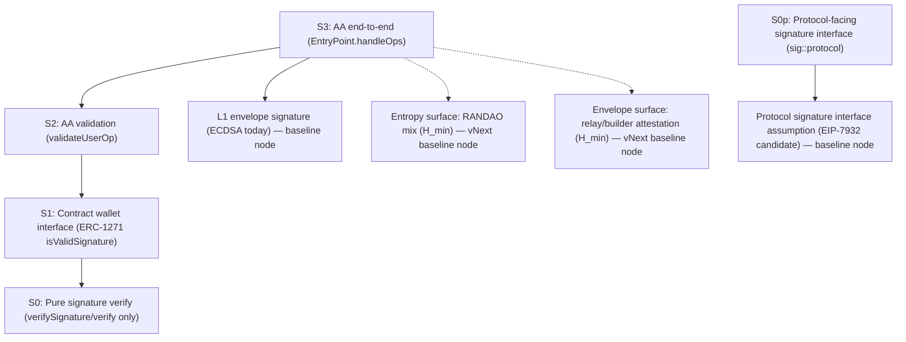
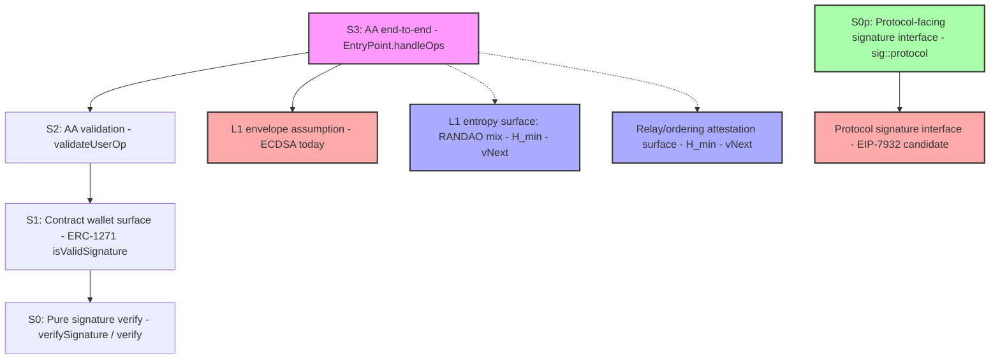

# Case Graph (execution-path dependencies)

This document defines canonical dependency graphs ("execution paths") used to compute weakest-link effective security.

---

## Node Naming Convention

Use `scheme::bench_name` when a node corresponds to a dataset record.  
Use `baseline::<name>` for conceptual baselines.

---

## Baseline Nodes (recommended)

- `baseline::l1_envelope_ecdsa_assumption`
  - Protocol-level L1 transaction envelope signature assumption (classical ECDSA).
  - Declared security: 128 bits (classical)

- `baseline::sigproto_eip7932_assumption`
  - Protocol-facing signature verification surface (precompile / enshrined interface candidate).
  - Represents the assumption that a protocol-level signature verification interface (e.g., EIP-7932-style precompile) is available and trusted.
  - Security: inherits from the underlying cryptographic primitive (e.g., ML-DSA-65 → 192 bits)

---

## Canonical Graphs

### G1 — AA / ERC-4337 end-to-end (EntryPoint.handleOps)

Represents the full user operation execution path (bundler tx → EntryPoint → account validation).

**Dependencies:**
- `falcon1024::qa_handleOps_userop_foundry` (measured)
- `baseline::l1_envelope_ecdsa_assumption` (conceptual baseline)

**Weakest-link effective security:**
- `min( security(falcon1024::qa_handleOps_userop_foundry), security(baseline::l1_envelope_ecdsa_assumption) )`

---

### G2 — AA account validation only (validateUserOp)

Represents account-level authentication without the full handleOps envelope.

**Dependencies:**
- `falcon1024::qa_validateUserOp_userop_log` (measured)
- `baseline::l1_envelope_ecdsa_assumption` (conceptual baseline)

**Weakest-link effective security:**
- `min( security(falcon1024::qa_validateUserOp_userop_log), security(baseline::l1_envelope_ecdsa_assumption) )`

---

### G3 — PQ primitive verification only (library / contract verify)

Represents pure on-chain PQ verification primitive cost, without protocol envelope assumptions.

**Dependencies:**
- `falcon1024::falcon_verifySignature_log` (measured)

**Effective security:**
- `security(falcon1024::falcon_verifySignature_log)`

---

### G4 — Protocol-facing signature verification (precompile path)

Represents a protocol-level signature verification path via a precompile / enshrined interface (e.g., EIP-7932).

**Dependencies:**
- `mldsa65::sigproto_verify` (hypothetical protocol-facing verification)
- `baseline::sigproto_eip7932_assumption` (protocol interface trust assumption)

**Weakest-link effective security:**
- `min( security(mldsa65::sigproto_verify), security(baseline::sigproto_eip7932_assumption) )`

**Note:** This graph isolates the protocol-facing surface from app-facing surfaces (ERC-7913).

---

**Important:** Gas is taken from the measured S3/S2 benchmark node; baseline nodes contribute only to effective security via weakest-link.

---

## Notes

- These graphs are intentionally minimal: they isolate the protocol envelope dominance effect.
- Additional edges can be introduced for sequencing/randomness/attestation surfaces as the dataset expands.

**Taxonomy:**
- **S0–S3** = surface taxonomy (benchmark scopes)
- **G1–G4** = canonical graphs (execution paths over surfaces + baselines)

---

## vNext: AA + protocol envelope graph (entropy / attestation surfaces)

### Canonical surfaces (summary)

- **S0:** Pure signature verify (verifySignature / verify())
- **S0p:** Protocol-level signature interface / precompile (protocol-facing verify boundary)
- **S1:** Contract wallet interface (ERC-1271 isValidSignature)
- **S2:** AA validation (validateUserOp)
- **S3:** AA end-to-end (EntryPoint.handleOps)
- **E\*:** Envelope / entropy / attestation surfaces (vNext)

### Canonical AA weakest-link (L1) with entropy/attestation nodes (vNext)

`AA_handleOps` depends on:
- `AA_validateUserOp`
- `baseline::l1_envelope_ecdsa_assumption` (L1 envelope)
- `randao::l1_randao_mix_surface` (entropy surface; vNext)

`AA_validateUserOp` depends on:
- wallet signature verification surface (PQ candidate, e.g. Falcon/ML-DSA)

### Weakest-link rule

For any pipeline row with `depends_on`:
- `effective_security_bits = min(security_bits(dep_i))`
- For entropy nodes: `security_bits(dep)` is `H_min` in bits.

**Lookup rule:**
- If node is `scheme::bench_name`, take `security_metric_value` from that dataset record.
- If node is `baseline::...`, use declared constant value defined in this document.

---

## Canonical AA weakest-link case graph (L1, v0)

This graph is a *surface taxonomy + dependency model* used to prevent apples/oranges comparisons and to make protocol envelope dominance explicit.



### Effective security rule

For any pipeline node with `depends_on[]`:

```
effective_security_bits = min(security_bits(dep_i))
```

Where `security_bits(x)` is derived from records with:
```
security_metric_type ∈ {security_equiv_bits, lambda_eff, H_min}
```

**Interpretation (L1):** even if the wallet signature is PQ (e.g., 256), end-to-end AA can still be bounded by the L1 envelope (e.g., 128).

---

## Canonical AA envelope graph (L1)



**Note:** S3 depends on protocol envelope and entropy/attestation surfaces (vNext).  
**Weakest-link model:** `effective_security_bits = min(security_bits over deps)`.

Dotted lines indicate vNext dependencies that are not yet mandatory (threat model not finalized).

---

## Protocol-facing vs App-facing paths

- **App-facing path:** S3 → S2 → S1 → S0 (ERC-7913 adapters, wallet integration)
- **Protocol-facing path:** S0p → SIGPROTO (precompile / enshrined interface candidate)

**Key difference:**
- App-facing surfaces are bounded by L1 envelope (baseline::l1_envelope_ecdsa_assumption)
- Protocol-facing surfaces depend on the protocol signature interface assumption (baseline::sigproto_eip7932_assumption)

**Goal:** Keep ABI shapes compatible across both paths and use shared KAT schemas to avoid divergent benchmarking conventions.
